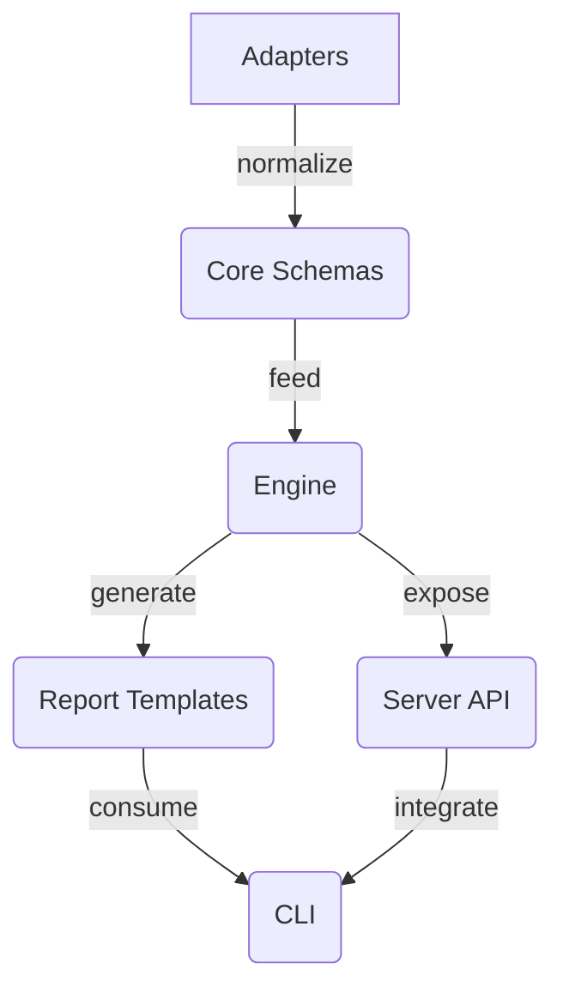

# SOIPack Mimarisi

SOIPack monoreposu altı temel paketten oluşur:

1. **Core** – Tüm artefakt türleri için doğrulama ve domain modelini sağlar. Diğer paketlerin tamamı core paketinden türetilen türleri kullanır.
2. **Adapters** – Çeşitli araçlardan gelen verileri core şemalarına dönüştürür. Jira CSV, ReqIF, JUnit XML, LCOV/Cobertura ve Git kaynaklarını normalize etmek için temel yardımcıları içerir.
3. **Engine** – Normalize edilmiş verileri hedef eşleme ve izlenebilirlik grafı oluşturma için işler. Skorlamalar ve bağ durumları bu katmanda hesaplanır.
4. **Report** – Motorun oluşturduğu izlenebilirlik grafını HTML/JSON çıktılara dönüştürür ve Playwright `printToPDF` akışını soyutlar.
5. **CLI** – Geliştiricilerin adaptörleri çalıştırması, motoru tetiklemesi ve raporları üretmesi için uçtan uca komutlar sunar.
6. **Server** – Express tabanlı REST API ile izlenebilirlik yeteneklerini uzak uygulamalara taşır. OpenAPI dokümantasyonu üretmek için motor ve rapor paketlerini kullanır.

Veri akışı adaptörlerden başlar, core şemalarına uygun hale getirilen kayıtlar engine paketine iletilir. Motor, ilişkileri hesapladıktan sonra sonuçlar rapor ve server paketleri tarafından kullanıcı arayüzlerine veya otomasyonlara sunulur. CLI katmanı adaptör, motor ve rapor işlemlerini komut satırı üzerinden orkestre eder.
