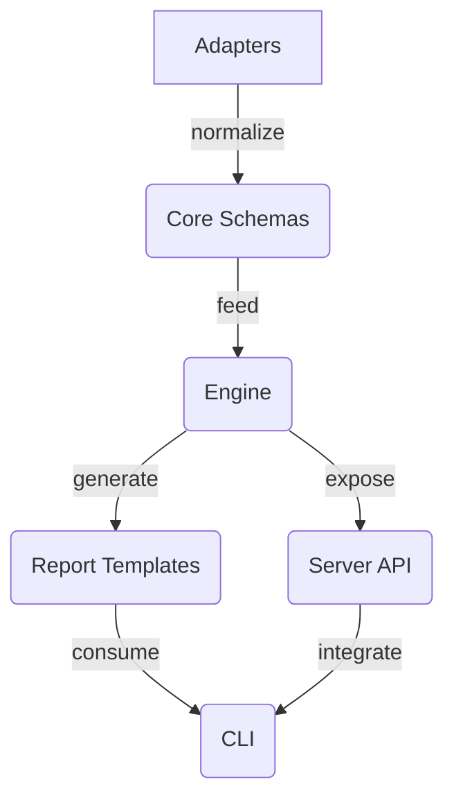

# SOIPack Mimarisi

SOIPack monoreposu altı temel paketten oluşur:

1. **Core** – Tüm artefakt türleri için doğrulama ve domain modelini sağlar. Diğer paketlerin tamamı core paketinden türetilen türleri kullanır.
2. **Adapters** – Çeşitli araçlardan gelen verileri core şemalarına dönüştürür. Jira CSV, ReqIF, JUnit XML, LCOV/Cobertura ve Git kaynaklarını normalize etmek için temel yardımcıları içerir.
3. **Engine** – Normalize edilmiş verileri hedef eşleme ve izlenebilirlik grafı oluşturma için işler. Skorlamalar ve bağ durumları bu katmanda hesaplanır.
4. **Report** – Motorun oluşturduğu izlenebilirlik grafını HTML/JSON çıktılara dönüştürür ve Playwright `printToPDF` akışını soyutlar.
5. **CLI** – Geliştiricilerin adaptörleri çalıştırması, motoru tetiklemesi ve raporları üretmesi için uçtan uca komutlar sunar.
6. **Server** – Express tabanlı REST API ile izlenebilirlik yeteneklerini uzak uygulamalara taşır. OpenAPI dokümantasyonu üretmek için motor ve rapor paketlerini kullanır.

Veri akışı adaptörlerden başlar, core şemalarına uygun hale getirilen kayıtlar engine paketine iletilir. Motor, ilişkileri hesapladıktan sonra sonuçlar rapor ve server paketleri tarafından kullanıcı arayüzlerine veya otomasyonlara sunulur. CLI katmanı adaptör, motor ve rapor işlemlerini komut satırı üzerinden orkestre eder.

## Gözlemlenebilirlik ve HTTP günlükleri

Server paketi Express üzerine kuruludur ve tüm HTTP istekleri için benzersiz bir `X-Request-Id` üretir. Her yanıt tamamlandığında Pino logger'a tek satırlık yapılandırılmış bir kayıt (`event: http_request`) gönderilir; kayıtta yöntem, yönlendirilen rota, durum kodu, milisaniye cinsinden süre, tenant kimliği (varsa) ve istemci IP'si bulunur. Aynı kimlik Prometheus sayaç ve histogram metrikleri (`soipack_http_requests_total`, `soipack_http_request_duration_seconds`) ile etiketlenerek gözlemlenebilirlik araçlarına aktarılır. Bu sayede dağıtık ortamlarda log ve metrik korelasyonu sağlanır ve sorunlu istekler hem merkezi log yönetiminde hem de metrik panellerinde aynı kimlikle incelenebilir.

## Ledger Merkle kanıt formatı

Ledger girdileri, kanıt manifesti, zaman damgası ve her kanıt bağlantısı için SHA-256 yaprakları üreten bir Merkle ağacına dönüştürülür. Yapraklar şu sırayla hashlenir: `snapshot`, `manifest`, `timestamp` ve `evidence:<snapshotId>:<path>`. Her yaprağın kanıtı, `[ { position: 'left'|'right', hash }, ... ]` şeklinde pozisyonlu kardeş düğümlerden oluşur ve `leaf` nesnesi (tip, etiket, yaprak hash'i) ile birlikte `merkleRoot` değeriyle serileştirilir. `serializeLedgerProof` fonksiyonu bu yapıyı JSON'a dönüştürür, `deserializeLedgerProof` ise aynı biçimi tekrar nesneye çevirir. Kanıt doğrulaması sırasında yol boyunca hash birleşimleri `hash(left, right)` şeklinde tekrar hesaplanır; herhangi bir adım değiştirilirse `LedgerProofError` fırlatılarak defter bütünlüğünün bozulduğu raporlanır.
